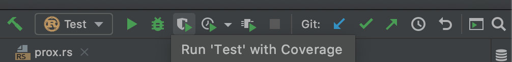
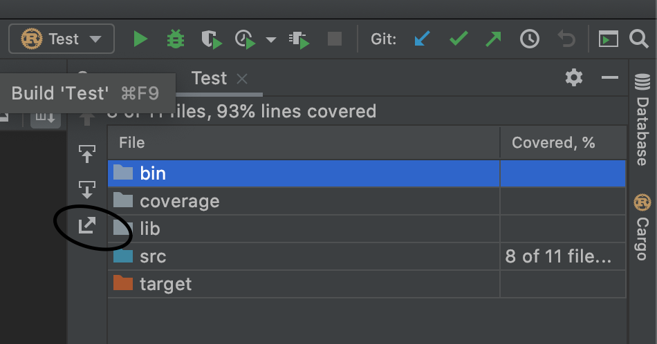

# Contributing to LCSO

## Filing issues

When filing an issue, make sure to answer these five questions:

1. What version of Rust are you using (`rustc --version`)?
2. What did you do?
3. What did you expect to see?
4. What did you see instead?

## Report a Bug

Open an issue. Please include descriptions of the following:
- Observations
- Expectations
- Steps to reproduce

## Contributing code

In general, this project follows Rust project conventions. Please make sure
you've linted, formatted, and run your tests before submitting a patch.

## Contribute a Bug Fix

- Report the bug first
- Create a pull request for the fix

## Suggest a New Feature

- Create a new issue to start a discussion around new topic. Label the issue as `new-feature`

## Developer guidelines

### Linting and formatting
To lint the code, run `cargo clippy`. For more information about `clippy`
and its various options, see [here](https://github.com/rust-lang/rust-clippy).

To format the code, run `cargo fmt`. For more information about the various
rules, see [here](https://github.com/rust-lang/rustfmt).

### Generating documentation
To generate the documentation for the code, run `cargo doc`. Once the
documentation has been generated, you can view and poke around the
documentation by opening `$PROJECT_ROOT/target/doc/lcso/index.html`.

### Code coverage
Code coverage for Rust projects is not a mature area of the ecosystem. The best
way I know how to generate a coverage report is to:
1. Load the project in the [CLion editor](https://www.jetbrains.com/clion/).
2. Set up a run/debug configuration that runs the tests as shown.
   
3. In the top right of the editor, select **Run '\<config name\>' with Coverage**.
   
4. After it runs, on the left pane of the window that displays the coverage,
   there is a button that exports the coverage report as an [`lcov`](https://github.com/linux-test-project/lcov) file. You will
   be prompted to specify a location to export the report to.
   
5. Once you've exported the coverage report, make sure you have the `lcov` tool
   installed, then navigate to the directory that has the `.lcov` file, 
   then run `$LCOV_INSTALL_LOCATION/bin/genhtml $LCOV_FILE`.
6. To view the report, run `open index.html` from the directory you performed step (5) in. 
   The report should open in your browser.